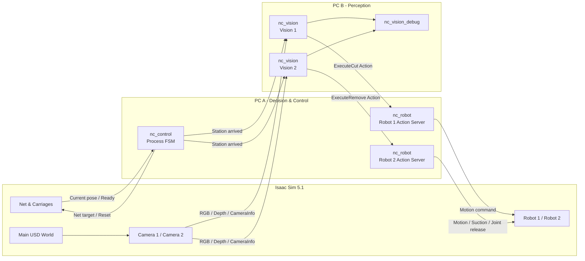

# ♻️ NetClean 폐어망 자동 절단·수거 시스템

> ROS 2 Jazzy + NVIDIA Isaac Sim 5.1 + YOLO11 기반 폐어망 처리 시뮬레이션

NetClean은 컨베이어로 이동하는 폐어망을 두 개의 작업 구역에서 자동 처리하는
디지털 트윈 프로젝트입니다. Station 1에서는 RGB-D 영상으로 폐기물을 인식해
Robot 1이 주변 어망을 절단하고, Station 2에서는 Robot 2가 폐기물을 흡착·분리해
지정된 위치로 옮깁니다.

메인 월드, 로봇·카메라·컨베이어 에셋, Isaac Sim standalone 코드, ROS 2 패키지와
학습된 YOLO 가중치를 한 저장소에서 제공합니다.

---

## 📌 주요 기능 (Key Features)

### 1. 반복 공정 및 어망 이송 (Process Control)

- `nc_control`의 상태 머신이 `Station 1 → Station 2 → EXIT → RESET` 순서를 관리합니다.
- 현재 위치와 목표 위치를 비교해 도착을 판단하고 각 작업 노드에 시작 신호를 보냅니다.
- 작업·이송·초기화 시간 초과를 wall clock watchdog으로 감시합니다.
- `repeat_enabled`와 `max_cycles` 파라미터로 단일 또는 반복 공정을 선택할 수 있습니다.

### 2. Station 1 비전 절단 (Vision-guided Cutting)

- Camera 1의 RGB-D 영상에서 `plastic_bottle`, `can`, `buoy`를 YOLO11로 검출합니다.
- Bounding Box 방향과 여백을 이용해 객체별 절단점 `P1`, `P2`를 계산합니다.
- `/cut/execute` Action으로 절단 목표를 Robot 1에 전달합니다.
- Robot 1은 `APPROACH → CONTACT → CUT → RETREAT → HOME` 순서로 움직이며 실패 시 안전 복구를 시도합니다.

### 3. Station 2 폐기물 수거 (Depth-guided Removal)

- Camera 2의 RGB-D 영상으로 남아 있는 폐기물을 다시 인식합니다.
- `plastic_bottle`은 내부 ROI의 유효 Depth 중앙값을 사용해 안정적인 흡착점을 선택합니다.
- `can`과 `buoy`는 Bounding Box 중심 기반 Depth 좌표를 사용합니다.
- Robot 2는 접근, 흡착, Fixed Joint 해제, 이동, 배출, Home 복귀를 수행합니다.
- 제거 후 새 프레임을 재검사하고 연속 빈 프레임이 확인되면 Station 2 완료를 알립니다.

### 4. 안전 복구 및 상태 검증 (Robust Recovery)

- 두 로봇 모두 동작 실패 시 `RETREAT → RECOVERY_HOME → 재진입` 복구 절차를 수행합니다.
- 흡착 상태, Joint 해제 결과, 로봇 동작 완료 여부를 확인한 뒤 다음 단계로 진행합니다.
- 치명적인 오류는 `/process/fault` 또는 `/sim/fault`로 전파됩니다.

### 5. 멀티 PC Bringup 및 디버그 화면

- PC A: 상위 공정 제어와 Robot 1·2 노드 실행
- PC B: Vision 1·2 노드와 YOLO 추론 실행
- 디버그 패키지: 검출 영상, Action 상태, Depth 좌표와 공정 진행 상황 표시

---

## 🛠️ 시스템 설계 (System Architecture)

시스템은 `Simulation`, `Decision & Control`, `Perception` 세 계층으로 구성됩니다.

1. **Simulation:** Isaac Sim이 월드, 물리, 카메라, 로봇과 어망 이동을 담당합니다.
2. **Decision & Control:** PC A의 `nc_control`과 `nc_robot`이 공정 순서와 로봇 동작을 관리합니다.
3. **Perception:** PC B의 `nc_vision`이 RGB-D 영상에서 절단·수거 목표를 계산합니다.



### ROS 2 패키지 구성

| 패키지 | 역할 |
|---|---|
| `nc_interfaces` | `ExecuteCut`, `ExecuteRemove`, `CutTarget`, `RemoveTarget` 인터페이스 |
| `nc_control` | 어망 이송과 전체 공정 상태 머신 |
| `nc_robot` | Robot 1 절단 및 Robot 2 흡착·수거 Action Server |
| `nc_vision` | YOLO11 추론, RGB-D 좌표 계산, Action Client |
| `nc_vision_debug` | Vision 1·2 디버그 팝업과 대시보드 영상 |
| `nc_bringup` | PC A·PC B 실행 파일과 공통 파라미터 |

---

## 🔄 알고리즘 플로우 차트 (Logic Flow)


---

## 💻 개발 환경 (Environment)

| 항목 | 환경 |
|---|---|
| OS | Ubuntu Linux |
| Middleware | ROS 2 Jazzy, Fast DDS (`rmw_fastrtps_cpp`) |
| Simulator | NVIDIA Isaac Sim 5.1 |
| Language | Python 3, Bash, YAML |
| Vision | Ultralytics YOLO11, OpenCV, NumPy |
| ROS Libraries | `rclpy`, `cv_bridge`, `message_filters`, `geometry_msgs`, `sensor_msgs` |
| Simulation Formats | USD, USDC, USDZ, URDF, OBJ, MDL |

모든 실행 PC는 같은 `ROS_DOMAIN_ID`와 RMW 구현을 사용해야 합니다. Isaac Sim은
호스트 GPU 드라이버와 설치 버전에 맞는 자체 Python 환경으로 실행합니다.

---

## ⚙️ 사용 장비 (Hardware Setup)

이 저장소는 아래 장비의 Isaac Sim 디지털 트윈을 기준으로 구성되어 있습니다.
실제 PC의 CPU·GPU 모델은 저장소에 고정하지 않으며 Isaac Sim 5.1 요구 사양을
충족해야 합니다.

| 구성 요소 | 모델 / 형식 | 역할 및 주요 ROS 연결 |
|---|---|---|
| Robot 1 | Doosan M0609 + Cutter TCP | Station 1 폐어망 절단 |
| Robot 2 | Doosan M0609 + VG10 | Station 2 폐기물 흡착·수거 |
| Vision 1 | Intel RealSense D455 (Sim) | `/camera1/rgb/image_raw`, `/camera1/depth/image_raw` |
| Vision 2 | Intel RealSense D455 (Sim) | `/camera2/rgb/image_raw`, `/camera2/depth/image_raw` |
| Transport | Net rigid body + 4 carriages | `/net/target_pose`, `/net/current_pose` |
| Compute A | ROS 2 Control PC | `nc_control`, `nc_robot`, `nc_bringup` |
| Compute B | Vision GPU PC | `nc_vision`, YOLO11, 선택적 디버그 팝업 |

---

## 📂 저장소 구성 (Repository Structure)

```text
netclean_project/
├── README.md
├── THIRD_PARTY_NOTICES.md         # 외부 에셋 출처와 라이선스
├── docs/ASSET_MANAGEMENT.md       # 대용량 에셋·제출 관리 기준
├── LICENSES/Apache-2.0.txt
├── models/netclean_yolo11n/       # YOLO 설정과 best.pt
├── ros2_ws/src/                   # 6개 ROS 2 패키지
├── scripts/
│   ├── run_standalone.sh          # Isaac Sim 실행 스크립트
│   ├── verify_submission.py       # 제출 구성 자동 점검
│   └── make_submission_archive.sh # 추적 파일만 제출 ZIP으로 생성
└── sim/
    ├── assets/project1/           # 메인 USD와 참조 에셋
    ├── cobot3_ws/                 # Robot 1 상대 참조 USD
    ├── config/sim_config.yaml
    └── standalone/                # Isaac Sim Python 실행 계층
```

- 메인 시뮬레이션 파일: `sim/assets/project1/simulation_integration_v3.usd`
- M0609 URDF: `sim/assets/project1/robot2_sample/m0609_isaac_sim.urdf`
- M0609 DAE 메시: `sim/assets/project1/robot2_sample/meshes/`
- 기본 standalone: `sim/standalone/netclean_standalone.py`
- `build/`, `install/`, `log/` 및 ZIP 백업 파일은 Git 추적에서 제외됩니다.

---

## 📦 의존성 설치 (Installation)

### 1. 저장소 받기

```bash
git clone https://github.com/suuuhululu/isaac_ros2_waste_net_cutting2.git
cd isaac_ros2_waste_net_cutting2
python3 scripts/verify_submission.py
```

현재 저장소의 필수 에셋은 일반 Git으로 관리되므로 별도의 666MB 원본 압축본이나
Git LFS 다운로드가 필요하지 않습니다. 위 검사가 통과하면 USD, URDF 메시, ROS 2
패키지와 YOLO 가중치가 모두 내려온 상태입니다.

### 2. ROS 2 의존성 설치

ROS 2 Jazzy가 설치된 Ubuntu 환경에서 실행합니다.

```bash
sudo apt update
sudo apt install python3-colcon-common-extensions python3-rosdep

# rosdep을 처음 사용하는 PC에서만 실행
sudo rosdep init
rosdep update

rosdep install --from-paths ros2_ws/src --ignore-src -r -y
```

### 3. Python 비전 라이브러리 설치

YOLO 추론과 영상 처리를 위한 라이브러리입니다. ROS 2가 사용하는 Python 환경에
설치해야 합니다.

```bash
python3 -m pip install ultralytics
```

### 4. ROS 2 워크스페이스 빌드

```bash
cd ros2_ws
source /opt/ros/jazzy/setup.bash
colcon build --symlink-install
cd ..
```

---

## 🚀 실행 순서 (How to Run)

전체 시스템은 아래 순서로 실행합니다. 여러 PC를 사용할 때는 동일한 저장소와 ROS 2
환경을 준비하고 모든 터미널에서 Domain ID를 통일합니다.

### 1. 공통 ROS 2 통신 설정

```bash
export RMW_IMPLEMENTATION=rmw_fastrtps_cpp
export ROS_DOMAIN_ID=144
```

### 2. Isaac Sim 실행 (Simulation PC)

ROS 2 Bridge가 포함된 Isaac Sim 설치 경로를 지정한 뒤 메인 standalone을 실행합니다.
스크립트가 저장소 내부의 메인 USD와 URDF를 자동으로 찾습니다.

```bash
export ISAAC_SIM_ROOT=/absolute/path/to/isaacsim
./scripts/run_standalone.sh
```

GUI 없이 실행하려면 다음 옵션을 사용합니다.

```bash
./scripts/run_standalone.sh --headless
```

### 3. PC A 실행 (Control & Robots)

```bash
source /opt/ros/jazzy/setup.bash
source ros2_ws/install/setup.bash
ros2 launch nc_bringup pc_a.launch.py
```

### 4. PC B 실행 (Vision)

```bash
source /opt/ros/jazzy/setup.bash
source ros2_ws/install/setup.bash
ros2 launch nc_bringup pc_b.launch.py
```

현재 `pc_b.launch.py`는 Depth 보정 V2 Vision 1·2를 실행합니다.
`pc_b_v2.launch.py`는 명시적 V2 실행을 위한 호환용 launch이며 두 파일을 동시에
실행하면 안 됩니다.

### 5. 디버그 팝업 실행 (선택)

```bash
source /opt/ros/jazzy/setup.bash
source ros2_ws/install/setup.bash
ros2 launch nc_vision_debug debug_popups.launch.py
```

팝업 토픽과 Vision V2 세부 동작은 [README_INSTALL.md](README_INSTALL.md)를
참고하십시오.

---

## ✅ 동작 확인 (Verification)

먼저 제출 파일 구성과 URDF 상대경로를 검사합니다.

```bash
python3 scripts/verify_submission.py
```

```bash
ros2 topic echo /process/state
ros2 topic echo /sim/ready --once
ros2 topic echo /net/current_pose --once
ros2 action list
```

정상 상태에서는 `/cut/execute`, `/remove/execute` Action과 카메라·공정 토픽이
표시됩니다. 코드 변경 후에는 다음 명령으로 핵심 비전 좌표 테스트를 실행할 수 있습니다.

```bash
cd ros2_ws
source /opt/ros/jazzy/setup.bash
source install/setup.bash
python3 -m pytest src/nc_vision/test/test_vision_geometry.py -q
```

---

## 📦 대용량 에셋과 제출 방법

제공된 `isaac_simulation_intergration (2).zip`은 약 666MB이지만 원본·구버전·중복
재질을 함께 담은 보관용 파일입니다. 이 ZIP 자체는 Git에 올리지 않습니다. 메인
USD의 실제 의존성만 `sim/assets/project1/`에 파일 단위로 포함했으며, 현재 가장 큰
추적 파일은 GitHub의 일반 Git 단일 파일 제한보다 작으므로 Git LFS도 필요하지
않습니다.

GitHub 링크 제출 시에는 `main` 브랜치 URL과 최종 커밋 해시를 제출합니다. 단일 ZIP
파일 제출이 필요하면 모든 변경을 커밋한 뒤 다음 명령을 실행합니다.

```bash
./scripts/make_submission_archive.sh
```

스크립트는 Git 최종 커밋만 묶기 때문에 금지된 `build`, `install`, `log`와 로컬 ZIP
백업이 들어가지 않습니다. 향후 단일 필수 에셋이 100MiB를 넘을 때만 Git LFS를
적용합니다. 선별 기준과 LFS 절차는
[에셋 관리 문서](docs/ASSET_MANAGEMENT.md)를 참고하십시오.

---

## ⚠️ 주의사항

- `pc_b.launch.py`와 `pc_b_v2.launch.py`를 동시에 실행하지 마십시오.
- 모든 PC에서 `ROS_DOMAIN_ID`와 `RMW_IMPLEMENTATION`을 동일하게 설정하십시오.
- `OmniPBR.mdl`, `OmniGlass.mdl`과 일부 NVIDIA Base Material은 Isaac Sim 기본 또는
  온라인 에셋을 사용하므로 재질 표시를 위해 해당 에셋에 접근할 수 있어야 합니다.
- 전체 실행은 NVIDIA GPU, Isaac Sim 5.1과 ROS 2 Jazzy가 설치된 Ubuntu 환경을
  전제로 합니다. `git clone`은 프로젝트 파일을 제공하지만 이 시스템 의존성까지
  설치하지는 않습니다.
- `sim/standalone/`의 버전명 파일은 개발 이력용이며 기본 진입점은
  `netclean_standalone.py`입니다.
