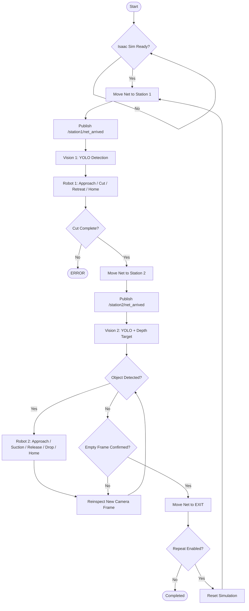

# NetClean — 폐어망 이물질 절단 · 제거 자동화 (Isaac Sim 디지털 트윈 · ROS 2)

폐어망에 얽힌 플라스틱 병 · 캔 · 부표를 **카메라로 찾아 로봇이 어망을 자르고, 흡착해 떼어낸 뒤, 다시 찍어 제거를 확인한다.** 실제 설비를 만들기 전에 카메라 위치 · 로봇 도달성 · 물리 결합 · 공정 순서를 Isaac Sim 디지털 트윈에서 먼저 검증하는 프로젝트다.

https://github.com/user-attachments/assets/64e6e503-a420-4058-8fd8-c774d934e16e


> 두산 ROKEY Boot Camp 9기 · 협동-3 프로젝트 "디지털 트윈 기반 로봇 자동화 시뮬레이션 시스템 구현" · D그룹 3조 **포바오** (이수현 · 박성현 · 박진용 · 서동권, 이한혁 중도 포기, 멘토 손미란) · 2026-08-15 ~ 08-28

| 항목 | 내용 |
|---|---|
| 로봇(시뮬레이션) | Doosan M0609 2대 — Robot 1 Cutter · Robot 2 VG10 흡착 그리퍼 |
| 소프트웨어 | Ubuntu 24.04 · ROS 2 Jazzy · Isaac Sim 5.1 · Python · YOLO11 · OpenCV |
| 결과 | Isaac Sim 에서 Station1 절단 → Station2 흡착 제거 → Vision2 재검사 → Exit 1사이클 시연 · YOLO11n 합성데이터 mAP50 0.995 · 반복 성공률 등 정량 지표는 **미측정**([결과](#결과)) |
| 바로 해 보기 | GPU · Isaac Sim 없이 Ubuntu 24.04 PC 한 대로 빌드 · 좌표 변환 시험 · 제출 구성 점검을 해 본다 → [실행 방법 1](#실행-방법) |

## 목차

1. [내 역할](#내-역할)
2. [주요 기능](#주요-기능)
3. [시스템 구성](#시스템-구성)
4. [결과](#결과)
5. [실행 방법](#실행-방법)
6. [개발 환경 · 사용 장비](#개발-환경--사용-장비)
7. [프로젝트 구조](#프로젝트-구조)
8. [팀 · 라이선스](#팀--라이선스)

## 내 역할

4명이 함께 만든 팀 프로젝트이고, 그중 내가 맡은 부분은 이렇다. — **박진용**

- **Standalone 실행 계층 설계** — `SimulationApp` · `world.step()`(60 Hz) · `rclpy.spin_once()` 를 한 루프로 묶고, Net 이송 · 로봇 모션 · 흡착 · Joint 해제를 클래스로 나눴다([`netclean_standalone_v2_home_joint_fix_v2.py`](sim/standalone/netclean_standalone_v2_home_joint_fix_v2.py)).
- **로봇 모션 제어**(박성현과 공동) — 월드 TCP 목표 → Tool Offset 역보정 → Lula IK → 속도 기반 smoothstep 관절 보간. 관절 오차 ≤ 1° 와 timeout 으로 완료를 판정하고, Home 은 IK 대신 안전 관절값으로 이동한다.
- **작업 순서 · 실패 복구** — Robot 1 절단, Robot 2 흡착 제거 시퀀스와 `RETREAT → RECOVERY_HOME → 재진입` 복구, 실패 시 Action abort([`robot1_node.py`](ros2_ws/src/nc_robot/nc_robot/robot1_node.py) · [`robot2_node.py`](ros2_ws/src/nc_robot/nc_robot/robot2_node.py)).
- **흡착 · Joint 해제 안전장치** — 흡착 성공 응답을 확인한 뒤에만 어망 Joint 를 해제하고, 표면–TCP 거리 ≤ 3 cm 를 검사한 뒤 부착해 Snap 을 막았다.
- **시스템 병합 · 테스트** — 노드별 기능을 PC A · PC B 분산 구조로 병합하고, Net 위치 ±2 cm · 관절 오차 ≤ 1° · 흡착 상태 응답 같은 단계별 성공 기준으로 통합 시연을 확인했다.

## 주요 기능

- **책임을 나눈 4개 노드** — Control(공정 FSM) · Vision(YOLO + RGB-D → 3D 목표) · Robot(작업 순서) · Standalone(Isaac Sim 물리 · IK 실행). 센서 · 상태는 Topic, 로봇 작업 요청은 Action(Goal · Feedback · Result)으로 나눠 오류 원인을 노드 단위로 좁힌다.
- **명령이 아니라 실제 상태로 넘어가는 공정** — Net 도착은 `/net/current_pose` 가 목표 ±2 cm 안에 들어왔을 때만 인정하고, 로봇 모션은 관절 오차 ≤ 1° 와 완료 응답으로 판정한다.
- **어망 위 이물질의 3D 목표 생성** — YOLO11 로 `plastic_bottle` · `can` · `buoy` 를 찾고 RGB · Depth 를 동기화해 `Pixel(u, v) + Depth + CameraInfo K` 를 카메라 좌표 → 월드 좌표로 바꾼다. 페트병은 투명 · 반사로 Depth 가 흔들려 유효 Depth 중앙값을 쓴다.
- **TCP 기준 모션 제어** — 월드 TCP 목표를 Tool Offset 으로 역보정해 Lula IK 로 풀고, 최대 관절 변화량 ÷ 속도(0.35 rad/s)로 이동 시간을 정해 smoothstep 으로 보간한다. 물리 · 렌더링은 60 Hz 한 루프에서 ROS 콜백과 함께 돈다.
- **절단 → 흡착 제거 시퀀스** — Robot 1 은 객체마다 절단점 P1 · P2 를 `APPROACH → CONTACT → HOLD → RETREAT` 로 처리한다. Robot 2 는 `PREGRASP → CONTACT → SUCTION ON → JOINT RELEASE → RETREAT → DROP → SUCTION OFF → HOME` 이며, **흡착 성공 응답을 확인한 뒤에만** 어망과 물체의 Fixed Joint 를 해제한다.
- **실패 복구와 재검사** — 접촉 실패 시 `RETREAT → RECOVERY_HOME → 재진입` 으로 한 번 더 시도하고, 복구까지 실패하면 Action 을 abort 한다. 제거 후에는 로봇 완료 이후의 **더 새로운 프레임**으로 재검사하고 연속 빈 프레임이 확인되면 Station 2 를 끝낸다.

## 시스템 구성

### 아키텍처

시스템은 `Simulation` · `Decision & Control` · `Perception` 세 계층이고, 두 PC 가 DDS(Fast DDS)로 연결된다. 시뮬레이션 실행 계층과 판단 계층을 나눠 책임을 고정하고 통합 · 디버깅 범위를 줄였다.

<p align="center">
  <br>
  <sub>PC A(Isaac Sim 실행 · 공정 제어 · Robot 노드)와 PC B(Vision · YOLO11 추론)를 ROS 2 DDS 로 연결</sub>
</p>

| 위치 | 구성 | 역할 |
|---|---|---|
| Simulation PC | Isaac Sim 5.1 + `netclean_standalone_v2_home_joint_fix_v2.py` | USD 월드 · 물리 · 카메라 · 어망 이송 · Lula IK 모션 · 흡착 · Joint 해제 실행 |
| PC A | `nc_control` · `nc_robot`(Robot 1 · 2) | 공정 순서 · 작업 순서 · 실패 복구 |
| PC B | `nc_vision`(Vision 1 · 2) · YOLO11 | 탐지 · 3D 목표 생성 · 재검사 |

<p align="center">
  <br>
  <sub>노드 구조 — control_node 가 공정을 관리하고, vision · robot 노드가 작업 결과와 요청을 주고받으며, standalone 이 실제 물리 동작을 수행한다</sub>
</p>

| 패키지 | 역할 |
|---|---|
| `nc_interfaces` | `ExecuteCut` · `ExecuteRemove` Action, `CutTarget` · `RemoveTarget` 메시지 |
| `nc_control` | 어망 이송과 전체 공정 상태 머신 |
| `nc_robot` | Robot 1 절단 · Robot 2 흡착 · 수거 Action Server, 공용 좌표 변환(`transform_utils`) |
| `nc_vision` | YOLO11 추론, RGB-D 좌표 계산, Action Client |
| `nc_vision_debug` | Vision 1 · 2 디버그 팝업과 대시보드 영상 |
| `nc_bringup` | PC A · PC B 실행 파일과 공통 파라미터 |

### 주요 통신

| 방식 | 인터페이스 | 송신 → 수신 | 역할 |
|---|---|---|---|
| Topic | `/sim/ready` | Standalone → Control | 시뮬레이션 준비 |
| Topic | `/net/target_pose` · `/net/current_pose` | Control ↔ Standalone | Net 목표 위치 · 실제 위치 피드백 |
| Topic | `/station1/net_arrived` · `/station2/net_arrived` | Control → Vision | Station 도착 알림 |
| Action | `/cut/execute` | Vision 1 → Robot 1 | 절단 목표 작업 요청 |
| Action | `/remove/execute` | Vision 2 → Robot 2 | 제거 목표 작업 요청 |
| Topic | `/robot1/motion_command` · `/robot2/motion_command` | Robot → Standalone | TCP Pose 전달 |
| Topic | `/robot1/motion_done` · `/robot2/motion_done` | Standalone → Robot | 실제 모션 완료 응답 |
| Topic | `/robot2/suction_command` · `/robot2/suction_state` | Robot 2 ↔ Standalone | 흡착 ON/OFF · 상태 응답 |
| Topic | `/robot2/release_attached_object` · `/robot2/joint_release_done` | Robot 2 ↔ Standalone | Net Joint 해제 요청 · 결과 |
| Topic | `/station1/cut_complete` | Robot 1 → Control | Station 1 절단 작업 완료 |
| Topic | `/station2/complete` | Vision 2 → Control | Station 2 제거 · 재검사 완료 |
| Topic | `/process/state` · `/process/fault` | Control → 전체 | 공정 상태 · 오류 |

### 동작 흐름

<p align="center">
  <br>
  <sub>전체 공정 플로우 차트</sub>
</p>

```
① 이송   어망이 Station 1 에 도착한다 (실제 위치가 목표 ±2 cm 안에 들어올 때까지 확인)
② 탐지   Vision 1 이 이물질(plastic_bottle · can · buoy)을 찾고 객체별 절단점 P1 · P2 를 만든다
③ 절단   Robot 1 이 Approach → Contact → Hold → Retreat 를 P1 · P2 에 대해 수행하고 HOME 으로 돌아간다
④ 이송   어망이 Station 2 로 이동한다
⑤ 제거   Vision 2 가 목표를 만들면 Robot 2 가 접근 → 흡착(응답 확인) → Joint 해제 → 이탈 → 배출 → 흡착 해제
⑥ 재검사  로봇 완료 이후의 새 프레임으로 다시 찍어 이물질이 없으면(연속 빈 프레임) Exit 로 이송한다
```

<details>
<summary>텍스트(Mermaid)로 보는 흐름도</summary>



</details>

공정 상태는 `WAIT_SIM → MOVING_STATION1 → WAIT_STATION1_COMPLETE → MOVING_STATION2 → WAIT_STATION2_COMPLETE → MOVING_EXIT → COMPLETED`(반복 시 `RESETTING`)이다. 상태가 맞지 않을 때 들어온 완료 메시지는 무시하므로 순서가 뒤바뀌어도 공정 순서가 바뀌지 않는다.

### 예외 처리

| 상황 | 동작 |
|---|---|
| Robot 1 접촉(CONTACT) 실패 | `RETREAT → RECOVERY_HOME → APPROACH → CONTACT` 로 한 번 더 시도. Home 복구가 실패하면 안전 재후퇴를 한 번 더 시도하고, 그래도 실패하면 해당 점만 건너뛰지 않고 **Action 전체를 abort** |
| Robot 2 흡착(SUCTION ON) 실패 | **Joint Release 를 요청하지 않고** 흡착을 끈 뒤 `RETREAT → HOME` 으로 안전 복귀, Action 을 실패로 종료 |
| Net 이동 중 | 목표를 보냈다는 사실이 아니라 실제 위치가 허용오차(`position_tolerance` 0.02 m) 안일 때만 도착 처리 |
| 상태가 멈춤 | wall clock(STEADY_TIME) 기반 0.25 초 Watchdog 이 상태별 timeout 을 감시(Station 1 · 180 s, Station 2 · 240 s, 리셋 · 45 s). `/clock` 이 멈춰도 동작 |
| IK 실패 · 모션 timeout | 실패 원인과 목표 pose 를 로그에 남기고 모션 실패로 응답 |

## 결과

아래는 이 저장소에서 **직접 확인할 수 있는** 값이다.

| 항목 | 결과 | 비고 |
|---|---|---|
| 전체 공정 시연 | Station1 절단 → Station2 흡착 제거 → Vision2 재검사 → Exit 1사이클 | Isaac Sim 시연 영상 기준. 반복 횟수 · 성공률은 **미측정** |
| 물체 탐지 | YOLO11n · 100 epoch · P 0.9994 · R 1.0 · mAP50 0.995 · mAP50-95 0.994 | **합성 데이터(Isaac Sim) 검증셋** 기준. 실환경 일반화는 미검증 |
| 좌표 변환 단위 시험 | 5 passed | `nc_vision/test/test_vision_geometry.py` |
| 빌드 · 제출 점검 | 패키지 6개 빌드 통과 · `verify_submission.py` 통과 | |

## 실행 방법

**1 은 GPU · Isaac Sim 없이 Ubuntu 24.04 PC 한 대에서 따라 하면 된다.**

### 1. 로봇 · 시뮬레이터 없이 확인할 수 있는 것

ROS 2 Jazzy 가 설치되어 있어야 한다([공식 안내](https://docs.ros.org/en/jazzy/Installation/Ubuntu-Install-Debs.html)).

```bash
git clone https://github.com/abyssGo/isaac_ros2_waste_net_cutting2.git
cd isaac_ros2_waste_net_cutting2
sudo apt install -y python3-colcon-common-extensions python3-pytest
python3 scripts/verify_submission.py
cd ros2_ws && source /opt/ros/jazzy/setup.bash && colcon build --symlink-install && cd ..
python3 -m pytest ros2_ws/src/nc_vision/test/test_vision_geometry.py -q
```

| 확인 | 통과 기준 |
|---|---|
| `verify_submission.py` 마지막 줄 | `제출 점검 통과` |
| 빌드 마지막 줄 | `Summary: 6 packages finished` |
| 좌표 변환 시험 | `5 passed` |

### 2. 전체 시스템 (Isaac Sim 필요)

NVIDIA GPU, Isaac Sim 5.1, ROS 2 Jazzy 가 설치된 Ubuntu 환경이 필요하다. 모든 PC 의 터미널에서 같은 값을 쓴다.

```bash
export RMW_IMPLEMENTATION=rmw_fastrtps_cpp
export ROS_DOMAIN_ID=144
python3 -m pip install ultralytics     # Vision PC
rosdep install --from-paths ros2_ws/src --ignore-src -r -y
cd ros2_ws && source /opt/ros/jazzy/setup.bash && colcon build --symlink-install && cd ..
```

| 순서 | PC | 명령 |
|---|---|---|
| ① | Simulation PC | `export ISAAC_SIM_ROOT=/absolute/path/to/isaacsim` → `./scripts/run_standalone.sh` (GUI 없이: `--headless`) |
| ② | PC A | `source ros2_ws/install/setup.bash` → `ros2 launch nc_bringup pc_a.launch.py` |
| ③ | PC B | `source ros2_ws/install/setup.bash` → `ros2 launch nc_bringup pc_b.launch.py` |
| ④ (선택) | PC B | `ros2 launch nc_vision_debug debug_popups.launch.py` |

`pc_b_v2.launch.py` 는 `pc_b.launch.py` 와 같은 V2 비전을 띄우는 호환용이므로 두 파일을 동시에 실행하지 않는다. 상세 동작은 [README_INSTALL.md](README_INSTALL.md) 에 있다.

### 3. 동작 확인

```bash
python3 scripts/verify_submission.py        # 제출 구성 · 상대경로 점검
ros2 topic echo /process/state
ros2 topic echo /sim/ready --once
ros2 action list                            # /cut/execute, /remove/execute 가 보이면 정상
python3 -m pytest ros2_ws/src/nc_vision/test/test_vision_geometry.py -q
```

> `OmniPBR.mdl` · `OmniGlass.mdl` 과 일부 NVIDIA Base Material 은 Isaac Sim 기본 · 온라인 에셋을 쓰므로 재질 표시를 위해 접근이 필요하다. 대용량 에셋 관리 기준은 [에셋 관리 문서](docs/ASSET_MANAGEMENT.md) 를 본다.

## 개발 환경 · 사용 장비

| 항목 | 값 |
|---|---|
| OS · 미들웨어 | Ubuntu 24.04 · ROS 2 Jazzy · Fast DDS(`rmw_fastrtps_cpp`) |
| 시뮬레이터 | NVIDIA Isaac Sim 5.1.0 (USD · Articulation · Lula IK · ROS 2 Bridge) |
| 언어 · 라이브러리 | Python 3 · `rclpy` · `cv_bridge` · `message_filters` · OpenCV · NumPy · Ultralytics YOLO11 |
| 협업 | Git/GitHub · Slack · Notion · Google Drive |

| 구성 요소 | 모델 · 형식 | 역할 · ROS 연결 |
|---|---|---|
| Robot 1 | Doosan M0609 + Cutter TCP(Visual End-Effector) | Station 1 폐어망 절단 |
| Robot 2 | Doosan M0609 + VG10 Suction Gripper | Station 2 폐기물 흡착 · 수거 |
| Camera 1 · 2 | Intel RealSense D455(시뮬레이션) | `/camera1/*` · `/camera2/*` RGB · Depth |
| Transport | Net rigid body + Carriage 4개 | `/net/target_pose` · `/net/current_pose` |

## 프로젝트 구조

```text
isaac_ros2_waste_net_cutting2/
├── README.md
├── README_INSTALL.md              설치 · Vision V2 상세
├── THIRD_PARTY_NOTICES.md         외부 에셋 출처와 라이선스
├── LICENSES/Apache-2.0.txt
├── docs/                          ASSET_MANAGEMENT.md — 대용량 에셋 선별 기준과 제출 방법
├── models/netclean_yolo11n/       YOLO 설정과 best.pt
├── ros2_ws/src/                   ROS 2 패키지 6개
├── scripts/                       run_standalone.sh · verify_submission.py · make_submission_archive.sh
├── sim/
│   ├── assets/project1/           메인 USD(simulation_integration_v3.usd) · M0609 URDF · 참조 에셋
│   ├── cobot3_ws/                 Robot 1 상대 참조 USD
│   ├── config/sim_config.yaml
│   └── standalone/
│       ├── netclean_standalone_v2_home_joint_fix_v2.py   Standalone 실행 계층
│       └── (v2 · v2_home_joint · fix · v4 · make_v4)      개발 이력 버전
```

## 팀 · 라이선스

| 이름 | 역할 |
|---|---|
| 이수현(팀장) | 비전 알고리즘 설계 · Replicator 합성 데이터 생성 · YOLO 학습 · 시스템 병합 · 테스트 |
| 박성현 | 인터페이스 설계 · 로봇 제어 알고리즘 |
| 박진용 | 로봇 제어 알고리즘 설계 · standalone 설계 · 시스템 병합 · 테스트 |
| 서동권 | USD · 에셋 제작 · Isaac Sim 환경 구축 |

[Apache License 2.0](LICENSES/Apache-2.0.txt). 외부 에셋의 출처와 라이선스는 [THIRD_PARTY_NOTICES.md](THIRD_PARTY_NOTICES.md) 를 따른다.
